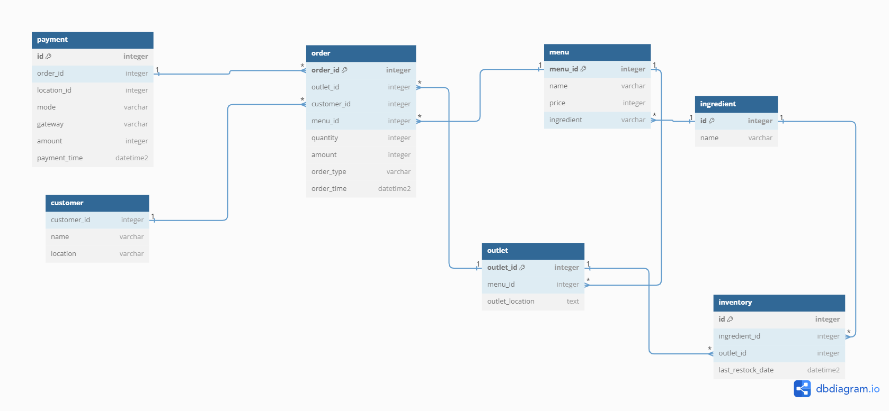

# Data Modelling Case Study: Fufu Republic

## Overview
Fufu Republic is a popular restaurant chain in Nigeria with multiple outlets nationwide. While the core menu is standardized, some items vary by location (e.g., the Agege branch may sell
Chinese Rice, while the Lekki branch might not). Customers can order online through the website or visit outlets for dine-in or take-out.

## Challenges
1. Inventory Management: Variations in customer demand and menu items across branches make it challenging to maintain optimal stock levels.
2. Customer Experience: The restaurant aims to improve the customer experience by offering personalized promotions based on purchasing behavior.

## Objective
Fufu Republic wants to leverage data to:
- Understand sales trends across locations, payment methods, and dining options(dine-in, take-out, online).
- Manage stock levels efficiently, reducing waste and ensuring availability.
- Enhance customer experience by analyzing purchasing habits and tailoring promotions accordingly.

As a recently hired data engineer at Fufu Republic, I have been tasked with developing a dimensional model to address the business's needs for data-driven decision-making.
1. Map out the necessary entities, relationships and constraints: This should be a
model (Any degree of abstraction is okay)
2. Create a dimensional model:
- Identify a business process of your choice
- List the business question under the business process that was selected
- Identify the grain, dimensions and fact.

## Solution

### Dimensional Model
Business Process:
Analyzing sales performance and customer purchasing behavior across branches, payment methods, and dining options.

### Business Questions:
- What are the total sales for each branch over a specific period?
- Which payment methods are most used by customers at different branches?
- How do sales vary between dine-in, take-out, and online orders?
- What are the popular menu items in each branch?

#### Fact Table: Order
Order: Represents each transaction made by a customer, which includes attributes like order_id, outlet_id, customer_id, menu_id, quantity, amount, order_type, and order_time. This links directly with the payment, customer, menu, and outlet tables.

*The grain of this table will be at the individual order level, where each row represents one order.*
Grain: Each order transaction.

#### Dimension Tables:
- Payment: Captures details about payments made for orders, with attributes like order_id, location_id, mode, gateway, amount, and payment_time. This table is connected to the order table by order_id, reflecting the payment details for each order.
- Menu: Stores information about the menu items available, including menu_id, name, price, and ingredient. This is linked to the order and outlet tables.
- Outlet: Represents the branches (or locations) of Fufu Republic with attributes like outlet_id, menu_id, and outlet_location. This is linked with the order, menu, and inventory tables to indicate which items are sold at each outlet and where stock is tracked.
- Customer: Captures customer details with attributes like customer_id, name, and location, linking to the order table to track orders by customers.
- Ingredient: Represents the ingredients required for menu items. This is linked to the menu table and plays a role in managing stock and inventory.
- Inventory: Manages the stock levels of ingredients at each outlet, with attributes like ingredient_id, outlet_id, and last_restock_date. This is important for inventory management and ensuring the availability of ingredients.

